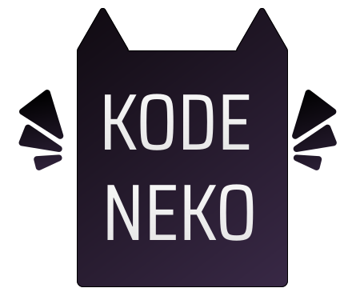

  

[💃 Personal Page](https://www.kodeneko.com) | [🐱 Github](https://github.com/kode-neko) | [🐤 Twitter](https://twitter.com/KodenekoFront) | [⚡ StackBlitz](https://stackblitz.com/@kode-neko) | [🧊 Codepen](https://codepen.io/kodeneko) | [🎨 Figma](https://www.figma.com/@kodeneko) | [✉️ Contact Mail](mailto:ladysun.freedom@gmail.com)

This backend has some services for my personal front-end projects. This project may vary along the time, so it will change the next time you visit it

# 📑 Services
- **🐱 Animal API:** To obtain a colletion of objects. Consist on an animal records (cats, dogs and cows ).
- **✉️ Contact API:** An endpoint to send messages thrugh a contact form.

# 🔗 Links

These projects uses this test back-end:

- [🏠 Personal Page](https://www.kodeneko.com)
- [🛍️ LionMiss Hub](https://www.kodeneko.com/lionmiss)

# ⚙️ Technologies
- [🛍️ Node](https://vuejs.org/api/options-state.html)
- [🐡 Express](https://vuejs.org/api/options-state.html)
- [🌳 Mongo](https://pinia.vuejs.org/)
- [☘️ Mongoose](https://pinia.vuejs.org/)

